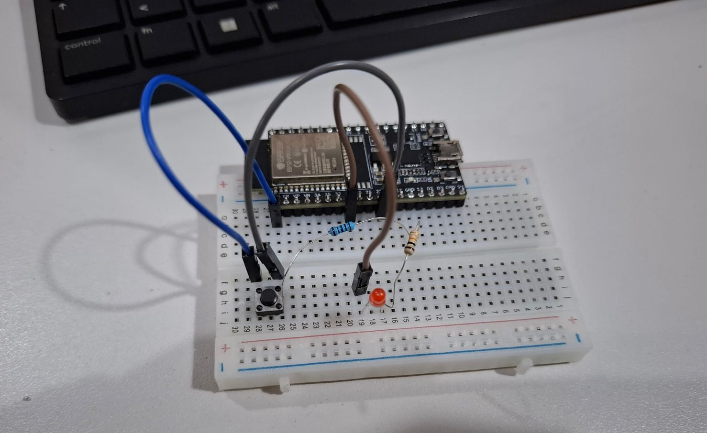

# Documentación del Proyecto

#Acerca de mi 
Me llamo Arturo Martínez Sosa, estoy estudiando mi primer semestre en la carrera de ingenieria mecatronica en la Ibero Puebla <3

![Mifoto]
 ---
##Intereses y enfoques 
Estoy interesado y enfocado en aprender acerca de electrónica, mecánica, programación y automatización.

---
##Información de contacto 
Correro: 203522@iberopuebla.mx
Teléfono: 2225227138

##Proyectos y logros
Un logro muy reciente es que acabo de aprender a usar SolidWorks para un proyecto de la escuela 

# Proyecto MCU 101
Este proyecto consistió en hacer prender y apagar un led por medio de un boton, y posteriormente por medio de un celular que le pase la informacion al esp32 por bluetooth para encenderlo y apagarlo.
 
##Código en Arduino 

##Aqui se muestra el led apagado
.

##Aqui se muestra el led encencido

##Video de led funcionando con boton 
https://youtube.com/shorts/4gLAL3IWOLs?feature=share

##Video led funcionando por bluetooth
https://youtube.com/shorts/xzuMIwzZtzU?feature=share

# Actuadores
Implementación del control de movimiento para actuadores

##Cambio de giro 
https://youtube.com/shorts/r9xEx3B_lzI?feature=share

##Video de motor con cambio de giro
https://youtube.com/shorts/uXsEfFbz2xI?feature=share

##Video con cambio de velocidad
https://youtube.com/shorts/uXsEfFbz2xI?feature=share

##Video de servo 0-10-0-20...
https://youtube.com/shorts/3mB7jcWFMh0?feature=share

